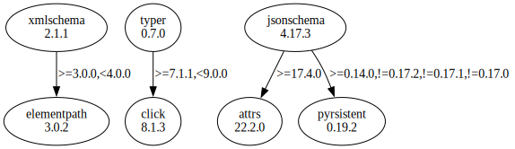

# Third Party Dependencies

<!--[[[fill sbom_sha256()]]]-->
The [SBOM in CycloneDX v1.4 JSON format](https://git.sr.ht/~sthagen/couscous/blob/default/sbom/cdx.json) with SHA256 checksum ([b3712e1a ...](https://git.sr.ht/~sthagen/couscous/blob/default/sbom/cdx.json.sha256 "sha256:b3712e1ab490c8a92eee11d6acb9047b3910ba9f98bda37ff856cad766635dbf")).
<!--[[[end]]] (checksum: 4ffdb37b61c023fc0f8fe486b90d0f66)-->
## Licenses 

JSON files with complete license info of: [direct dependencies](direct-dependency-licenses.json) | [all dependencies](all-dependency-licenses.json)

### Direct Dependencies

<!--[[[fill direct_dependencies_table()]]]-->
| Name                                                          | Version                                               | License     | Author            | Description (from packaging data)                                  |
|:--------------------------------------------------------------|:------------------------------------------------------|:------------|:------------------|:-------------------------------------------------------------------|
| [jsonschema](https://github.com/python-jsonschema/jsonschema) | [4.18.2](https://pypi.org/project/jsonschema/4.18.2/) | MIT License | Julian Berman     | An implementation of JSON Schema validation for Python             |
| [typer](https://github.com/tiangolo/typer)                    | [0.9.0](https://pypi.org/project/typer/0.9.0/)        | MIT License | Sebastián Ramírez | Typer, build great CLIs. Easy to code. Based on Python type hints. |
| [xmlschema](https://github.com/sissaschool/xmlschema)         | [2.3.1](https://pypi.org/project/xmlschema/2.3.1/)    | MIT License | Davide Brunato    | An XML Schema validator and decoder                                |
<!--[[[end]]] (checksum: 6103c4e485e203c7a7e61e3f15743d1c)-->

### Indirect Dependencies

<!--[[[fill indirect_dependencies_table()]]]-->
| Name                                                      | Version                                               | License     | Author                     | Description (from packaging data)                                    |
|:----------------------------------------------------------|:------------------------------------------------------|:------------|:---------------------------|:---------------------------------------------------------------------|
| [attrs](https://www.attrs.org/en/stable/changelog.html)   | [23.1.0](https://pypi.org/project/attrs/23.1.0/)      | MIT License | Hynek Schlawack <hs@ox.cx> | Classes Without Boilerplate                                          |
| [click](https://palletsprojects.com/p/click/)             | [8.1.3](https://pypi.org/project/click/8.1.3/)        | BSD License | Armin Ronacher             | Composable command line interface toolkit                            |
| [elementpath](https://github.com/sissaschool/elementpath) | [4.1.2](https://pypi.org/project/elementpath/4.1.2/)  | MIT License | Davide Brunato             | XPath 1.0/2.0/3.0/3.1 parsers and selectors for ElementTree and lxml |
| [pyrsistent](https://github.com/tobgu/pyrsistent/)        | [0.19.2](https://pypi.org/project/pyrsistent/0.19.2/) | MIT License | Tobias Gustafsson          | Persistent/Functional/Immutable data structures                      |
<!--[[[end]]] (checksum: 0ce8e2b47c1c98c431e1ae2334f6cb04)-->

## Dependency Tree(s)

JSON file with the complete package dependency tree info of: [the full dependency tree](package-dependency-tree.json)

### Rendered SVG

Base graphviz file in dot format: [Trees of the direct dependencies](package-dependency-tree.dot.txt)



### Console Representation

<!--[[[fill dependency_tree_console_text()]]]-->
````console
jsonschema==4.18.2
├── attrs [required: >=22.2.0, installed: 23.1.0]
├── jsonschema-specifications [required: >=2023.03.6, installed: 2023.6.1]
│   └── referencing [required: >=0.28.0, installed: 0.29.1]
│       ├── attrs [required: >=22.2.0, installed: 23.1.0]
│       └── rpds-py [required: >=0.7.0, installed: 0.8.10]
├── referencing [required: >=0.28.4, installed: 0.29.1]
│   ├── attrs [required: >=22.2.0, installed: 23.1.0]
│   └── rpds-py [required: >=0.7.0, installed: 0.8.10]
└── rpds-py [required: >=0.7.1, installed: 0.8.10]
typer==0.9.0
├── click [required: >=7.1.1,<9.0.0, installed: 8.1.3]
└── typing-extensions [required: >=3.7.4.3, installed: 4.4.0]
xmlschema==2.3.1
└── elementpath [required: >=4.1.2,<5.0.0, installed: 4.1.2]
````
<!--[[[end]]] (checksum: 910bbc9e2a181b536be8b4b5b1cea888)-->
